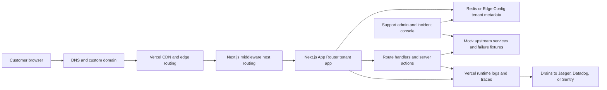
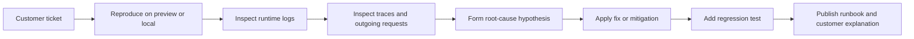

# Best GitHub Portfolio Project for the Vercel Senior Customer Support Engineer Role

## Executive summary

The strongest single portfolio project for this role is to fork **Vercel’s Platforms Starter Kit** and turn it into a **multi-tenant support reliability lab**: a Next.js application that uses custom domains and wildcard subdomains, host-based routing, preview deployments, observability, incident toggles, performance tests, and customer-facing troubleshooting documentation. That choice maps unusually well to the actual job: the role emphasizes solving technically complex customer cases, troubleshooting with Engineering, building internal tools and scripts, improving runbooks and guides, and having hands-on experience with Vercel, v0, and modern web architecture; React/Next.js and technical writing are explicitly called out as bonuses. citeturn40view0turn22search0

Among the repositories reviewed, **`vercel/platforms`** is the best base because it already gives you the most Vercel-native substrate for support-style work: custom subdomain routing with Next.js middleware, tenant-specific pages, Redis-backed tenant data, an admin interface, and compatibility with Vercel preview deployments. Vercel’s multi-tenant docs also make this base especially attractive for demonstrating domain verification, wildcard SSL, DNS propagation, custom domains, and programmatic domain management — all of which create realistic, customer-facing support scenarios that are hard to show convincingly in a typical CRUD portfolio app. citeturn22search0turn34view3turn34view0turn34view2

The correct strategy is **not** to present five disconnected demos. It is to build **one polished repo** that looks like a support engineer’s incident lab: reproducible failures, log and trace correlation, benchmark scripts, scripted DNS diagnostics, preview-based reproduction links, and concise runbooks written the way a support engineer would actually hand them to a customer or an internal escalation team. Vercel’s own platform documentation supports that approach: preview deployments are automatic for non-production branches, deployment checks can gate promotion, runtime logs expose host/cache/deployment/request metadata, tracing can capture infrastructure spans for routing, middleware, caching, and fetches, and Drains can forward logs and traces to external tooling. citeturn35view1turn35view2turn33view0turn32view2turn23search5turn23search7

## Role-fit criteria

The job description strongly suggests that your project should prove six things at once: that you can diagnose production web problems, that you understand Vercel deeply, that you can build tooling and scripts to reduce repeated toil, that you can communicate clearly to customers and internal teams, that you can operate in modern web architecture, and that you can write durable docs and runbooks. The role specifically calls for solving technically complex customer cases, troubleshooting alongside Engineering, building internal tools and scripts, improving documentation and runbooks, using Vercel and v0 hands-on, and explaining modern AI or web architectures clearly; it also explicitly values React/Next.js and technical writing. citeturn40view0

That requirement profile favors a project with **domain management, middleware routing, serverless and edge execution, preview environments, logs and traces, and reproducible incident fixtures** over a generic SaaS starter. Vercel’s own product surface on the career page reinforces the same emphasis: CI/CD, content delivery, Fluid Compute, observability, security, domains, Next.js, v0, and multi-tenant platforms are all core platform areas. citeturn40view0turn22search0

In practice, the most convincing portfolio repo for this role should therefore include all of the following, and explicitly mark missing pieces as unspecified when the underlying template does not provide them: **Next.js and Node-oriented routes, multi-tenant host routing, custom domain and wildcard DNS support, reproducible failure scenarios, runtime logs and tracing, customer-style triage guides, preview-based CI/CD, performance benchmarks, and some light infrastructure automation**. Vercel’s documented support surfaces make these scenarios tangible: runtime logs can be filtered by route, host, cache, environment, trace ID, and middleware metadata; traces can show routing, middleware, caching, outbound fetches, framework spans, and custom spans; wildcard domains require Vercel nameservers because Vercel must complete DNS-01 validation for certificates. citeturn33view0turn32view2turn34view1turn34view2

## Ranked shortlist

The shortlist below is ranked by **direct relevance to Vercel support work**, **breadth of troubleshooting scenarios**, and **how easily the project can be turned into one standout portfolio repo rather than a collection of unrelated demos**. Official Vercel templates are favored where possible because the role explicitly asks for hands-on familiarity with the platform. citeturn40view0turn22search0

| Rank | Project or template | Pros | Cons and unspecified attributes | How it maps to Vercel role skills | Source basis |
|---|---|---|---|---|---|
| 1 | **`vercel/platforms`** | Official Vercel multi-tenant Next.js starter; includes custom subdomain routing with middleware, tenant-specific content/pages, Redis tenant storage, admin interface, and preview deployment compatibility. | Observability stack, external monitoring, reproducible incident fixtures, formal test suites, Terraform, performance benchmarks, and security hardening are **unspecified in the starter materials reviewed**. | Best direct fit for troubleshooting host routing, custom domains, wildcard DNS, SSL issuance, preview behavior, and customer-facing docs/runbooks. | citeturn22search0turn34view3 |
| 2 | **`open-telemetry/opentelemetry-demo`** | Purpose-built for distributed observability; designed as a near-real-world microservice environment with synthetic load and feature-flagged failure scenarios. | Not Vercel-first; not Next.js-first; DNS and domain troubleshooting are weak; customer docs and IaC are **unspecified in the sources reviewed**. | Excellent donor for incident design, trace-based debugging, and “root-cause with evidence” workflows. | citeturn7search0turn9search8 |
| 3 | **`vercel/next.js` example `with-opentelemetry`** | Official Next.js example using `instrumentation.ts`; deployable on Vercel; explicitly points to a local dev collector setup and backend inspection path. | Small template; DNS, domain automation, performance benchmark suite, security hardening, and IaC are **unspecified in the example materials reviewed**. | Ideal donor for adding first-class tracing to the main portfolio repo without inventing the pattern from scratch. | citeturn38view0turn32view1turn25view0 |
| 4 | **`vercel/examples` `edge-middleware/hostname-rewrites`** | Demonstrates custom-domain-style routing via Edge Middleware, incremental static regeneration, mock database usage, and local tenant-style subdomain workflows. | Narrower scope than a full support lab; modern observability, formal tests, IaC, and security practices are **unspecified in the materials reviewed**; it is better as a donor than as the final portfolio on its own. | Strong donor for DNS, host-header, and middleware-routing incidents. | citeturn3search0turn3search1 |
| 5 | **`vercel/commerce`** | Performance-oriented, server-rendered Next.js App Router application using React Server Components and optimized storefront patterns. | DNS/networking labs, reproducible incident fixtures, observability stack, and IaC are **unspecified in the repository materials reviewed**. | Best donor for caching strategy, latency analysis, and performance-optimization narratives. | citeturn6search9 |

A useful way to read this table is: **use `vercel/platforms` as the base**, then borrow **incident design** from OpenTelemetry Demo, **instrumentation patterns** from `with-opentelemetry`, **hostname and wildcard routing ideas** from `hostname-rewrites`, and **performance patterns** from `vercel/commerce`. That yields a single coherent project instead of a patchwork portfolio. citeturn22search0turn7search0turn38view0turn3search0turn6search9

## Recommended base project and enhancement roadmap

The best base project is **`vercel/platforms`**, upgraded and reframed as something like **Support Reliability Lab for Multi-Tenant Next.js on Vercel**. This gives you the right Vercel-native architecture for demonstrating customer-facing support work: a single deployment serving many tenants, host-based routing, custom domains, wildcard subdomains, SSL issuance, and an admin surface where you can expose controlled incident toggles and diagnostics. Vercel’s own multi-tenant docs explicitly say this pattern is meant for one codebase serving many customers, with custom subdomains, fully custom domains, automatic SSL, domain management via API or SDK, and preview support; that is exactly the terrain where support engineers earn credibility. citeturn22search0turn34view3turn34view2



That architecture is worth showing because Vercel tracing can expose routing, middleware, caching, and outbound fetch behavior; runtime logs can be filtered by host, route, cache status, environment, trace ID, and deployment; and multi-tenant domain management introduces realistic scenarios around TXT verification, wildcard domains, SSL generation, and DNS propagation. citeturn32view2turn33view0turn34view3turn34view0

A rigorous enhancement plan looks like this:

| Milestone | Estimated effort | Deliverables |
|---|---:|---|
| **Foundation and repo framing** | 8–10 hours | Fork `vercel/platforms`; rename and rebrand; keep the multi-tenant architecture; add a support-facing `/admin` area; add a clear architecture diagram; add seed tenants such as `healthy`, `slow-api`, `broken-domain`, `stale-cache`, and `missing-trace`. The value here comes from preserving the starter’s middleware/domain model rather than simplifying it away. citeturn22search0turn34view3 |
| **Observability first** | 10–14 hours | Add `instrumentation.ts` with `@vercel/otel`; enable runtime logs, traces, and session tracing; add structured request correlation IDs; add Vercel Speed Insights; add either Sentry or Datadog as an external evidence layer; add a local collector path using the Vercel OpenTelemetry dev setup. Vercel docs make this combination especially strong because infrastructure spans, fetch spans, framework spans, and custom spans can all be made visible together. citeturn32view0turn32view1turn32view2turn31view0turn25view0turn36view0turn36view1turn36view2 |
| **Incident fixtures and reproducibility** | 12–16 hours | Add incident toggles and fixtures for timeout, payload-too-large, stale cache, wrong-tenant routing, custom-domain verification failure, and upstream 5xx. Each incident should have a single toggle, a matching GitHub issue, a reproducible URL or script, and a regression test. OpenTelemetry Demo is the model donor here because it shows how deliberately injected failures make observability useful instead of decorative. citeturn7search0turn9search8 |
| **DNS and networking lab** | 10–14 hours | Add domain onboarding scripts using the Vercel SDK; add DNS verification scripts using `dig`; add TLS inspection commands; add host-header testing locally; add docs for wildcard vs apex vs custom domains and TXT verification. The goal is to show comfort with the exact kinds of domain tickets Vercel customers file. citeturn34view3turn34view0turn34view1turn34view2 |
| **Performance and hardening** | 10–14 hours | Add Speed Insights dashboards, k6 benchmark scripts, response-cache analysis, streaming where appropriate, and documented `maxDuration` settings on deliberate repro routes. Add security headers and a CSP/report-only mode; document what is and is not configurable on Hobby versus Pro/Enterprise. Vercel docs are clear that runtime logs surface cache status and function metadata, while duration and memory tuning have plan/runtime-specific behavior. citeturn31view0turn33view0turn39view0turn39view1turn13search7turn13search8 |
| **CI/CD and support docs** | 10–12 hours | Wire GitHub Actions to lint, typecheck, test, run Playwright, and run k6 smoke checks against preview URLs; use Vercel Deployment Checks to gate production; write public troubleshooting guides, customer-facing “what to collect before opening a ticket” pages, and internal-style runbooks. The docs matter because the job explicitly values clear solutions and public technical writing. citeturn35view0turn35view1turn35view2turn40view0 |

A thoughtful optional flourish is to use **v0** to scaffold one or two support-facing UI surfaces — for example an incident console, a domain verification helper, or a runbook reader — and then refine the generated output manually. That creates a concrete answer to the job’s requirement for hands-on Vercel and v0 experience, without turning the portfolio project into an AI demo that loses the support focus. citeturn40view0

## Incident catalog and debugging playbooks

The project should ship with a small, curated set of incidents that look like real customer escalations rather than contrived coding exercises. The most important requirement is that each incident be **deterministic, reproducible, observable, and documented**. Vercel’s docs already provide natural anchors for several of them: invalid domain configuration, wildcard nameserver issues, function timeouts, edge timeouts, payload-too-large failures, cache analysis, and trace-based debugging. citeturn34view0turn34view2turn30search0turn30search3turn30search2turn30search5turn33view0turn32view2

A strong incident set would look like this:

| Incident | What the reviewer should see | Primary evidence path | Why it is valuable |
|---|---|---|---|
| **Invalid custom domain configuration** | Tenant domain shows invalid configuration or missing SSL. | `dig` outputs, TXT verification state, nameserver checks, cert inspection, domain onboarding logs. | This is classic Vercel support terrain and directly exercises DNS, ownership verification, and wildcard rules. citeturn34view0turn34view2turn34view3 |
| **Wrong tenant resolved from middleware** | Request to one host renders another tenant’s content. | Middleware logs, trace spans for routing, host header inspection, request ID, preview-vs-production comparison. | Demonstrates host-routing diagnosis and precise root-cause communication. citeturn33view0turn32view2turn22search0 |
| **Serverless timeout on slow upstream** | Customer sees 504 or stalled response. | Trace timeline, outgoing fetch spans, route-level `maxDuration`, upstream mock logs, retry behavior. | Very credible support scenario for Vercel Functions and external APIs. citeturn30search0turn30search3turn32view0turn39view0 |
| **413 payload too large** | Upload or API request fails under a reproducible size threshold. | Runtime logs, payload size capture, reproduction script, Blob alternative path. | Shows pragmatic debugging and platform-aware remediation. citeturn30search2 |
| **Stale cache or cache-miss regression** | Content remains stale or TTFB regresses on one tenant. | `x-vercel-cache`, runtime-log cache filters, traces, Speed Insights, k6 results. | Demonstrates performance tuning with evidence instead of guesswork. citeturn33view0turn31view0 |
| **Broken trace correlation** | Request log exists but downstream service spans are missing. | `traceparent` propagation analysis, `instrumentation.ts`, Drain output, Jaeger or external APM. | Shows a senior-level understanding of observability as a debugging system, not just a dashboard. citeturn32view0turn32view2turn23search7 |

Each incident should also ship with a short playbook. The playbooks below are the ones I would actually include in the repo.

**Custom domain and wildcard failure playbook.**  
Reproduce the error by onboarding a tenant domain in a deliberately misconfigured state: wrong `CNAME`, unverified TXT, or wildcard domain without Vercel nameservers. Confirm the current state with `dig ns`, `dig a`, and `dig cname`; then inspect whether the domain is added to the project, whether ownership verification is pending, and whether wildcard SSL is blocked by nameserver configuration. Fix the issue by correcting DNS, completing TXT verification if the domain is already in use on Vercel, or switching the apex domain to Vercel nameservers for wildcard support; finally verify that SSL issuance completes after propagation. This is directly aligned with Vercel’s documented troubleshooting flow. citeturn34view0turn34view1turn34view2turn34view3

**Wrong-tenant routing playbook.**  
Reproduce by sending requests with the wrong host mapping, either locally with a host header or via a test custom domain. Start in runtime logs, filtered by **Host**, **Route**, and **Deployment**, then compare what middleware thought the host was with what the app rendered. If traces are enabled, inspect the routing and middleware spans to see whether the error happens before render or inside the tenant lookup. Fix by hardening host normalization, tightening fallback rules, and adding an integration test that proves `tenant-a` can never render `tenant-b` data. Runtime logs and traces are especially useful here because they expose host, request path, middleware metadata, cache state, deployment, and trace correlation in one place. citeturn33view0turn32view2

**Serverless timeout playbook.**  
Reproduce by toggling a mock upstream to delay longer than the route’s intended tolerance. Confirm the behavior in traces: Vercel’s fetch spans and custom spans should show where the time is spent. If the route is a Next.js handler, set an intentionally small `maxDuration` on the repro route so the failure is deterministic and educational; then fix with one of three strategies: a faster upstream path, bounded retry logic, or streaming/architectural changes if the workload is legitimately long-running. Vercel documents both function and edge timeout classes, and it documents how `maxDuration` can be configured on modern Next.js routes. citeturn30search0turn30search3turn39view0turn32view2

**Payload-too-large playbook.**  
Reproduce with a request body deliberately larger than the platform limit on a specific upload route. Capture the request metadata in logs, note the payload size, and show the exact threshold in your fixture docs. The corrective path should demonstrate two remediations: reducing body size for ordinary API traffic, and using client-side uploads to Vercel Blob for large file flows so the file bypasses the serverless request body limit. That is a very support-engineer answer: explain root cause, explain the correct mental model, then redirect the customer to the right architecture. citeturn30search2

**Cache regression playbook.**  
Reproduce by publishing a tenant change, then serving stale content via a deliberate cache bug or a mismatched revalidation strategy. Use runtime logs to filter by **Cache** and compare `HIT`, `MISS`, and `STALE`; use traces to confirm whether render work is actually happening; use Speed Insights and k6 to quantify user-facing impact. Then fix by adjusting cache headers, ISR/revalidation behavior, or tenant cache keys, and show a before/after benchmark in the docs. Vercel logs are especially good here because cache status is exposed both as a filter and in request details. citeturn33view0turn31view0turn37view2

**Broken trace propagation playbook.**  
Reproduce by disabling propagation to one mock upstream or by routing through an ignored URL pattern. Confirm that the top-level request exists but downstream spans are disconnected. Then use `instrumentation.ts` to restore propagation rules for the intended upstreams and re-run the same scenario until the trace becomes contiguous. This playbook demonstrates a senior support habit: you are not merely fixing the symptom, you are fixing the evidentiary path that future debugging depends on. citeturn32view0turn32view2



That workflow mirrors the role itself: troubleshoot, find root cause, build tooling, and improve documentation so the same issue becomes easier to solve next time. citeturn40view0

## Suggested CI/CD, observability, and DNS or networking setups

The deployment model should be **GitHub + Vercel preview deployments + Deployment Checks**. Vercel automatically creates preview deployments for non-production branches and pull requests, and it can read commit statuses and selected GitHub Action results to block promotion until checks pass. That is ideal for a portfolio repo, because each issue can link to a preview URL, a failing workflow, and a fixed workflow. citeturn35view0turn35view1turn35view2

A practical CI workflow is:

```yaml
name: ci
on:
  pull_request:
  push:
    branches: [main]

jobs:
  quality:
    runs-on: ubuntu-latest
    steps:
      - uses: actions/checkout@v4
      - uses: actions/setup-node@v4
        with:
          node-version: 22
      - run: corepack enable
      - run: pnpm install --frozen-lockfile
      - run: pnpm lint
      - run: pnpm typecheck
      - run: pnpm test
      - run: pnpm playwright install --with-deps
      - run: pnpm test:e2e

  performance-smoke:
    if: github.event_name == 'pull_request'
    runs-on: ubuntu-latest
    steps:
      - uses: actions/checkout@v4
      - run: pnpm install --frozen-lockfile
      - run: pnpm k6 run ./perf/smoke.js
```

Use Vercel Deployment Checks to require `quality` and `performance-smoke` before production promotion, rather than treating preview deploys as your only safety net. citeturn35view2turn37view2turn16search0

For local and Vercel-native observability, the backbone should be **runtime logs + tracing + custom instrumentation + Speed Insights**. Next.js supports `instrumentation.ts` at the app root, and Vercel’s `@vercel/otel` package makes it easy to register OpenTelemetry plus fetch context propagation. Vercel tracing can automatically show infrastructure spans for routing, middleware, and caching; fetch spans for outgoing HTTP calls; and framework plus custom spans when you instrument the app. citeturn32view1turn32view0turn32view2

```ts
// instrumentation.ts
import { registerOTel } from '@vercel/otel';

export function register() {
  registerOTel({
    serviceName: 'support-reliability-lab',
    instrumentationConfig: {
      fetch: {
        propagateContextUrls: [
          'mock-upstream.internal',
          'tenant-api.internal',
        ],
      },
    },
  });
}
```

Pair that with Speed Insights in the root layout so you can show Core Web Vitals and route-level regressions:

```tsx
// app/layout.tsx
import { SpeedInsights } from '@vercel/speed-insights/next';

export default function RootLayout({
  children,
}: {
  children: React.ReactNode;
}) {
  return (
    <html lang="en">
      <body>
        {children}
        <SpeedInsights />
      </body>
    </html>
  );
}
```

Vercel documents both the package installation and the root-layout pattern for Speed Insights. citeturn31view0

For an external evidence layer, **Sentry** is the simpler “portfolio-visible” option if you want errors, traces, and source maps; **Datadog** is the stronger option if you want to demonstrate Vercel integration plus Vercel-derived metrics and logs. Sentry documents the Next.js App Router setup around `@sentry/nextjs` and `withSentryConfig`; Vercel’s tracing docs also warn that Sentry’s own OpenTelemetry setup can conflict with Vercel’s, so you should explicitly set Sentry up to coexist with `@vercel/otel`. Datadog’s Vercel integration, meanwhile, documents Vercel log-drain ingestion and Vercel function metrics such as requests, invocations, duration, memory, and errors; its Next.js RUM guide documents a client-component initialization path for App Router apps. citeturn36view0turn32view2turn36view1turn36view2

For local trace inspection, use the **Vercel OpenTelemetry collector dev setup**. Vercel’s dev-setup repository exposes **Jaeger**, **Zipkin**, and **Prometheus**, and the official Next.js `with-opentelemetry` example explicitly recommends it for local testing. Prometheus’ own installation docs also make the Docker path straightforward if you want to document the observability stack more explicitly. citeturn25view0turn38view0turn37view0

```bash
docker-compose up -d
# Jaeger:    http://0.0.0.0:16686
# Zipkin:    http://0.0.0.0:9411
# Prometheus:http://0.0.0.0:9090
```

For DNS and networking, the repo should include explicit verification scripts because Vercel’s domain troubleshooting docs are command-oriented. Vercel recommends using `dig` to inspect nameservers, apex `A` records, and subdomain `CNAME` records, and it documents common sources of invalid configuration such as stale records, missing TXT verification, mis-specified wildcard domains, propagation delay, and syntax mistakes in the record “name” field. citeturn34view0

```bash
# DNS checks
dig ns example.com
dig a example.com
dig cname www.example.com

# Local host-routing reproduction
curl -H "Host: tenant-a.localhost:3000" http://127.0.0.1:3000/

# TLS inspection
openssl s_client -servername tenant.example.com -connect tenant.example.com:443 </dev/null \
  | openssl x509 -noout -issuer -subject -dates
```

For domain automation, Vercel’s multi-tenant docs provide an exact SDK example for adding custom domains programmatically. That is worth including in the repo because it mirrors the kind of internal tool or script the job explicitly mentions. citeturn34view3turn40view0

```ts
import { VercelCore as Vercel } from '@vercel/sdk/core.js';
import { projectsAddProjectDomain } from '@vercel/sdk/funcs/projectsAddProjectDomain.js';

const vercel = new Vercel({
  bearerToken: process.env.VERCEL_TOKEN,
});

await projectsAddProjectDomain(vercel, {
  idOrName: 'support-reliability-lab',
  teamId: process.env.VERCEL_TEAM_ID!,
  requestBody: {
    name: 'customer-example.com',
  },
});
```

For infrastructure as code, the official route in the sources reviewed is **Terraform**, not CloudFormation. The Vercel Terraform provider documentation specifically references resources such as `vercel_project`, `vercel_project_domain`, and `vercel_dns_record`, so the cleanest portfolio move is to add a small `infra/terraform/` module that provisions the project shell and a test domain. **CloudFormation support for Vercel was unspecified in the reviewed materials.** citeturn14search3turn14search6turn14search0

Performance testing should use a mix of **k6** and Vercel-native measurements. k6 is designed for load, stress, soak, browser, and automated CI performance tests, while Vercel runtime logs and Speed Insights provide production-like evidence. Use k6 for repeatable thresholds such as tenant home p95 latency, tenant onboarding API p95 latency, and zero 5xx under a small concurrency test; use Speed Insights and runtime logs to prove that your fixes help real web performance and cache behavior. citeturn37view2turn31view0turn33view0

## Effort estimate and final README outline

A realistic total effort for a polished, interview-ready version of this project is **60 to 80 hours** if you already know Next.js and Vercel reasonably well. The lower bound is enough for a convincing portfolio repo; the upper bound is what it takes to make the incident fixtures, traces, tests, and docs feel professional rather than merely present. This is an estimate, not a sourced platform metric.

A sensible time split is:

| Area | Hours |
|---|---:|
| Repo fork, architecture cleanup, base data model | 8 |
| Observability instrumentation and local collector | 12 |
| Reproducible incident fixtures | 14 |
| DNS and domain automation lab | 10 |
| Performance tests and hardening | 10 |
| CI/CD and deployment checks | 6 |
| README, runbooks, issue writeups, postmortems | 10 |
| **Estimated total** | **70** |

The final README should look like a support engineer’s operating manual, not just a developer’s install note. GitHub’s README guidance is useful here: the README should explain what the project does, why it is useful, how to get started, where to get help, and who maintains it. citeturn27search12

A strong README outline would be:

- **Project overview**  
  Explain that this is a multi-tenant Next.js incident lab for Vercel support scenarios, built from `vercel/platforms`, designed to demonstrate debugging, runbooks, DNS triage, and customer communication.

- **Why this project is relevant to the Vercel role**  
  Tie the repo to complex casework, tooling, runbooks, documentation, Vercel fluency, and troubleshooting depth. citeturn40view0

- **Architecture**  
  Include the mermaid diagram, major services, runtimes, storage, observability path, and supported domain patterns. citeturn22search0turn32view2

- **Quick start**  
  Local setup, `vercel link`, `vercel env pull`, seeded tenants, and local host-routing commands. citeturn35view1

- **Incident scenarios**  
  A table of each incident, what breaks, how to reproduce, where to look first, and the expected fix.

- **Observability and evidence collection**  
  Runtime logs, trace filtering, Speed Insights, Jaeger, optional Sentry or Datadog, and how request IDs map across tools. citeturn33view0turn32view2turn31view0turn36view0turn36view1

- **DNS and domain troubleshooting guide**  
  `dig` commands, TXT verification, wildcard nameservers, propagation expectations, SSL notes, and local reproduction tips. citeturn34view0turn34view1turn34view2turn34view3

- **CI/CD and release safety**  
  Preview deployments, GitHub Actions, Deployment Checks, and how regressions are blocked before production aliasing. citeturn35view0turn35view1turn35view2

- **Performance testing**  
  k6 thresholds, Speed Insights interpretation, cache-status checks, and before/after numbers. citeturn37view2turn31view0turn33view0

- **Security and hardening**  
  Security headers, CSP/report-only, secret handling, permissions boundaries, and what remains deliberately out of scope.

- **Runbooks and customer-facing docs**  
  Links to `docs/troubleshooting/*`, `docs/postmortems/*`, and “What to collect before opening a support ticket.”

- **Open limitations**  
  Plan-specific features, what is mocked, and which integrations are optional.

## Open questions and limitations

Several attributes in the shortlisted repositories were marked **unspecified** because the materials reviewed did not clearly document them. That applies most often to formal test suites, IaC, security hardening, and explicit performance benchmark coverage in the starter repositories, not because they are impossible, but because they were not clearly described in the source materials reviewed. citeturn22search0turn38view0turn3search0turn6search9

Some Vercel capabilities that would strengthen the project are **plan-sensitive**. Multi-tenant preview URLs are Enterprise-only, even though ordinary preview deployments are broadly available. Drains are documented for Pro and Enterprise. Adjustable function memory is dashboard-configurable on Pro and Enterprise, not via `vercel.json`, while Hobby keeps the default memory profile. If you build the portfolio on a lower plan, document which pieces are mocked or simulated locally. citeturn22search1turn35view1turn23search5turn39view1

The cleanest IaC path in the reviewed materials is **Terraform** through the official Vercel provider and the Vercel SDK for domain automation. **CloudFormation support for Vercel was unspecified** in the materials reviewed, so I would not build the portfolio story around CloudFormation unless you independently decide to add AWS-side infrastructure around the mock upstream systems. citeturn14search0turn14search3turn14search6turn34view3

The final recommendation remains high-confidence despite those limits: **build one excellent, incident-rich, domain-heavy, observability-first fork of `vercel/platforms`**. It is the project most likely to make a Vercel reviewer think, “this person has already been doing support engineering on our kind of platform.” citeturn40view0turn22search0turn34view3