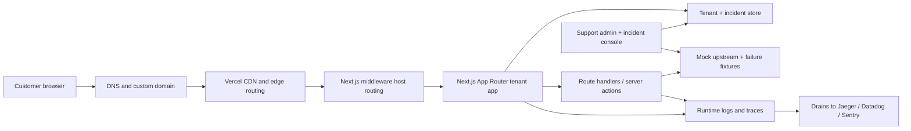
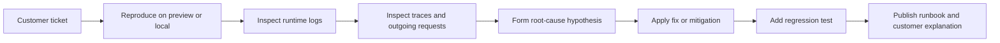

# Architecture — Support Reliability Lab

A multi-tenant Next.js application on Vercel, reframed as a **support engineer's
incident lab**. One deployment serves many tenants via host-based routing; an admin
console exposes controlled incident toggles so every failure is deterministic,
reproducible, observable, and documented.

The design follows the project's portfolio strategy notes (kept locally): instead of
five disconnected demos, one polished repo that looks like the place a Vercel support
engineer reproduces customer escalations and writes the runbook that closes them.

## System diagram

## Request lifecycle

1. A request arrives with a `Host` header (e.g. `slow-api.localhost:3000` or
   `slow-api.example.com`).
2. `middleware.ts` extracts the subdomain, normalizes it, and rewrites the request
   internally to `/s/<subdomain>`. The root domain renders the marketing/landing page
   and `/admin` the incident console.
3. The tenant page resolves the tenant from the store. If the tenant has an active
   incident, the corresponding fault is injected on this request path only.
4. Server actions + route handlers do the data work and emit traces/logs. The mock
   upstream (`/api/upstream`) is where injectable latency and 5xx faults live.

## Why these pieces

| Concern | Mechanism | Support scenario it enables |
|---|---|---|
| Multi-tenant routing | `middleware.ts` host parsing + rewrite | Wrong-tenant rendering, host-header bugs |
| Tenant + incident state | `lib/tenants.ts` (in-memory seed store) | One toggle per incident, reproducible on demand |
| Fault injection | `lib/incidents.ts` + `/api/upstream` | Timeouts, 5xx, payload-too-large, stale cache |
| Observability | `instrumentation.ts` (`@vercel/otel`) + Speed Insights | Trace-based root cause, cache-status evidence |
| Domains / DNS | `scripts/dns-check.sh`, `scripts/add-domain.ts` | Invalid config, wildcard SSL, TXT verification |
| Release safety | GitHub Actions + Vercel Deployment Checks | Block regressions before production aliasing |

## Tenant + incident model

A tenant is `{ subdomain, name, plan, incident }`. `incident` is one of the keys in the
incident catalog (or `none`). The store is a plain in-memory module seeded with lab
tenants so the project runs offline with zero external services. The seam is designed
so the store can later be swapped for Redis / Upstash / Edge Config without changing
callers — see `lib/tenants.ts`.

### Seed tenants

| Subdomain | Incident | What breaks |
|---|---|---|
| `healthy` | `none` | Control. Renders fast, traces clean. |
| `slow-api` | `serverless-timeout` | Upstream fetch delays past tolerance → 504. **Wired in this pass.** |
| `broken-domain` | `invalid-domain` | Domain shows invalid config / missing SSL (DNS lab). |
| `stale-cache` | `cache-regression` | Content stays stale / TTFB regresses. |
| `missing-trace` | `broken-trace` | Request log exists but downstream spans are missing. |

## Incident catalog

Each incident is deterministic, reproducible, observable, and documented. Full
playbooks live in `docs/incidents/`. The catalog is the source of truth in
`lib/incidents.ts`.

| Incident key | Primary evidence path | Status |
|---|---|---|
| `serverless-timeout` | Trace timeline, fetch spans, route `maxDuration`, upstream logs | **Implemented** |
| `invalid-domain` | `dig`, TXT state, nameserver/cert inspection | Documented (DNS lab) |
| `wrong-tenant` | Middleware logs, routing spans, host-header inspection | Guarded by test |
| `payload-too-large` | Runtime logs, payload size, Blob alternative | Documented |
| `cache-regression` | `x-vercel-cache`, log cache filters, Speed Insights, k6 | Documented |
| `broken-trace` | `traceparent` propagation, `instrumentation.ts`, drain output | Documented |

## Support workflow (mirrors the role)

The Claude Code skills in `.claude/skills/` encode steps of this loop:
`incident-repro`, `trace-debug`, `dns-triage`, and `runbook-writer`.

## Out of scope / mocked (this pass)

- External APM (Sentry/Datadog) and log drains are documented, not wired.
- Tenant store is in-memory; Redis/Edge Config is a documented swap point.
- Real custom domains require Vercel + DNS; the DNS lab works against any domain you own.
- Plan-sensitive features (multi-tenant preview URLs, drains, adjustable memory) are
  noted where relevant in the strategy notes.
